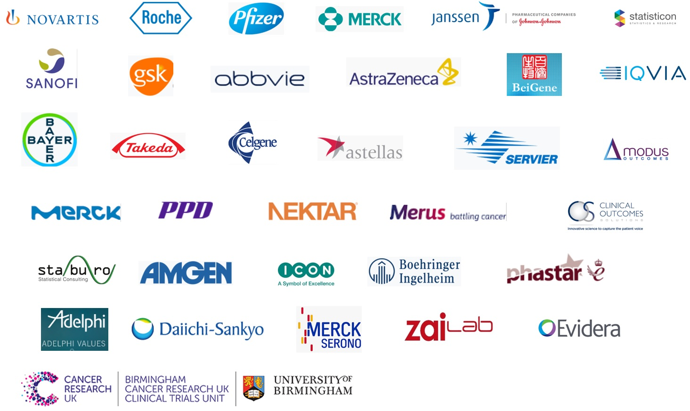

```{r setup, include=FALSE}
## load packages
packs.html <- c("knitr", "pander", "reporttools", "dplyr", "readxl")
for (i in 1:length(packs.html)){library(packs.html[i], character.only = TRUE)}

knitr::opts_chunk$set(echo = TRUE)
panderOptions('table.alignment.default', function(df){ifelse(sapply(df, is.numeric), 'right', 'left')})

path <- getwd()

## =================================================================
## functions
## =================================================================
source(file = paste(path, "/tools/mydisp.r", sep = ""))
source(file = paste(path, "/tools/lead.r", sep = ""))

## =================================================================
## member list
## =================================================================
email <- as.data.frame(read_excel(paste(path, "/data/members.xlsx", sep = ""), col_types = NULL))

## function to display
ind <- email[, "Type"] == "Industry" 
loc <- email[ind, "Location"]
com <- email[ind, "Institution"]

## Current month
today <- Sys.Date()
tod <- format(today, format = "%d %B %Y")

## subteams
subteams <- c("Causal", "Switching", "Censoring", "Solid", "Hematology")

## talks
talks <- as.data.frame(read_excel(paste(path, "/data/conferences.xlsx", sep = ""), col_types = NULL))
```

Link to this page: [http://www.oncoestimand.org](http://www.oncoestimand.org)

# Background {.tabset .tabset-fade .tabset-pills}

## History of the working group

The [draft addendum](https://www.ema.europa.eu/en/documents/scientific-guideline/draft-ich-e9-r1-addendum-estimands-sensitivity-analysis-clinical-trials-guideline-statistical_en.pdf) of the [ICH E9 guideline on Statistical Principles for Clinical Trials](https://database.ich.org/sites/default/files/E9_Guideline.pdf) was released in August 2017 and introduced an estimand framework. In February 2018, Evgeny Degtyarev from [Novartis](http://www.novartis.com) and [Kaspar Rufibach](https://www.kasparrufibach.ch) from [Roche](http://www.roche.com) started an informal working group to discuss how to implement the draft addendum in oncological clinical trials. 

In November 2018, the working group was subsequently established more formally by [EFSPI](https://www.efspi.org) as [_European special interest group "Estimands in oncology", sponsored by PSI and EFSPI_](https://www.efspi.org/EFSPI/Special_Interest_Groups/Estimands_in_Oncology_Applications.aspx?&WebsiteKey=0b28fec8-fcd6-4283-b360-0c689a893140&hkey=956f9eca-da64-48a4-88e4-e77d796bb527) and in June 2019 the [_ASA biopharmaceutical section_](https://community.amstat.org/biop/home) has granted the official status as [ASA scientific working group](https://community.amstat.org/biop/workinggroups/eio).

In December 2019, the final version of the [ICH E9 estimand addendum](https://database.ich.org/sites/default/files/E9-R1_Step4_Guideline_2019_1203.pdf) was published.

## Scope

The estimand framework aims at aligning trial objectives and statistical analyses by demanding a precise definition of the inferential quantity of interest, the estimand. The addendum is anticipated to have a major impact on drug development, as the choice of an estimand will drive the trial design and sample size, conduct, data collection, and analysis of clinical trials moving forward. Furthermore, the framework is anticipated to facilitate discussions about relevant treatment effects, interpretation of study results, and added value of the drugs between sponsors, regulators, payers, physicians, and patients. 

The need to amend E9 with a discussion on estimands grew out of the realization of an apparent lack of alignment between the objectives stated in a clinical trial protocol and the accompanying quantification and interpretation of the treatment effect reported in a regulatory submission. While the estimand framework has been developed with different clinical trial settings and endpoints in mind, the examples discussed in publications, at scientific meetings, and in the addendum have largely focused on symptomatic studies and continuous, longitudinal endpoints. However, in oncology primary endpoints in clinical trials are typically of the time-to-event (T2E) type (such as overall, progression-free, or event-free survival). For these endpoints, there are still many open questions concerning endpoint definition, data collection, analysis methodology, interpretation, and use in drug development. The working group aims at bringing together statisticians from industry, regulators, and academia to ensure common understanding and consistent definitions for key estimands in oncology across and share experiences, intercurrent events, and the used sensitivity analyses. Key questions that are discussed are:

 + How can time-to-event (T2E) endpoints be embedded in the addendum framework?
 + What are key estimands and intercurrent events in Oncology? 
 + How do the five strategies to handle intercurrent events proposed in the ICH E9 addendum apply to T2E endpoints?
 + How can established methods to answer questions in oncology, e.g. treatment switching or various censoring schemes, be embedded in the addendum framework, what estimands has been usually targeted?
 + The addendum in its current version does not require a causal interpretation of a proposed estimand. However, are there parts in the drug development lifecycle that require a causal interpretation of an estimand?
 + Being aware that the hazard ratio from Cox regression does not admit a causal interpretation, what are effect measures for T2E endpoints that are amenable to a causal interpretation?
 + The addendum in its current version does not require a causal interpretation of a proposed estimand. However, are there parts in the drug development lifecycle that require a causal interpretation of an estimand? 
 + Being aware that the hazard ratio from Cox regression does not admit a causal interpretation, what are effect measures for T2E endpoints that are amenable to such a causal interpretation?
 
Furthermore, increased transparency on the treatment effect of interest is considered an important goal of the addendum in order to facilitate discussions between different stakeholders. However, no guidance on protocol implementation has been provided so far, and there is a risk that the same estimand will be described in different ways by sponsors, potentially leading to confusion for regulators, physicians, patients, and possibly even inconsistent labels. Therefore, it is desired to ensure common understanding and consistent definitions for estimands across industry.

## Status

As of `r tod`, the working group 

 + has `r length(loc)` members (`r sum(loc == "EU")` from Europe, `r sum(loc == "NorAm")` from US, and `r sum(loc == "Asia")` from Asia) representing `r length(unique(com))` companies,
 + regularly interacts with eight Health Authorities globally,
 + regularly organizes sessions and presents at conferences,
 + has started to interact with academic colleagues.



# Organization {.tabset .tabset-fade .tabset-pills} 

## Leads

Evgeny Degtyarev from [Novartis](http://www.novartis.com) and [Kaspar Rufibach](https://www.kasparrufibach.ch) from [Roche](http://www.roche.com), both located in Basel, Switzerland. Their email addresses are generic _firstname.lastname@employer.com_.

## Ways of working 

The working group operates within five subteams:

 + Causal estimands in time-to-event setting (lead by [Kaspar Rufibach](https://www.kasparrufibach.ch) from [Roche](http://www.roche.com)): Focuses on identifying situations when causal interpretation is necessary and meaningful causally interpretable estimand(s) and corresponding analyses in time-to-event setting. The subteam will also assess possible applications of principal stratification in Oncology.
 + Treatment switching (lead by `r lead("switching", 2)`): Interested in the impact of different types of treatment switching and different estimands targeting OS and PFS2 endpoints.
 + Censoring mechanisms and their impact on interpretation of estimands (lead by `r lead("censoring", 2)`): Evaluates the use of censoring to handle intercurrent events, related assumptions and interpretation, discussing the often performed sensitivity analyses and possible alternatives in view of estimand framework.
 + Case studies in solid tumors (lead by `r lead("solid", 2)`) and in hematology (lead by `r lead("hematology", 2)`): They focus on the discussion of relevant estimands targeting PFS/DFS/EFS, intercurrent events and sensitivity analyses in the different settings across solid and hematology.

These subteams hold regular TCs and work on white papers and presentations.

## Activities

Beyond work in the subteams, the aim of the working group is to provide answers to the above questions through a variety of activities. These will include: 

 + Collaborating with experts to refine and possibly extend available methods.
 + Publishing reviews of the available methods, case studies, and white papers with recommendations, for statisticians and non-statisticians.
 + Interacting with regulators and the broader clinical community to obtain a better understanding of their requirements. Work with them to agree on common definitions of estimands in oncology.
 + Providing trainings, workshops and talks.
 + Promoting good practice through templates for study protocols and statistical analysis plans.

## Become a member

The general spirit of the working group is inclusive. If you'd like to contribute in one or the other way, we propose you first reach out to your company's representative(s) (if applicable) and align within your company who is best placed to contribute to which subteam. After that is clarified reach out to Evgeny or Kaspar.

# Interactions with Health Authorities and the ICH E9(R1) working group

We are grateful for ongoing collaboration and regular dialogue to statisticians from European Medicines Agency (EMA), 
Medicines and Healthcare products Regulatory Agency (MHRA, UK), U.S. Food and Drug Administration (FDA), Pharmaceuticals and Medical Devices Agency (PMDA, Japan), Health Canada, Swissmedic, National Medical Products Administration (NMPA, China) and Center for Drug Evaluation (CDE, Taiwan). 

In September 2020, the WG presented to all these regulatory agencies the results of the work that had been done within the WG until then. The slidedeck with a concise summary of all the submitted papers is available for [download](docs/202009 Summary of Onco Estimand WG papers.pdf).

We also thank Keaven Anderson (Merck) and Frank Bretz (Novartis) for their support.

# Publications

## Accepted or published

* Lawrence, R., Degtyarev, E., Griffiths, P., Trask, P., Lau, H., D'Alessio, D., Griebsch, I., Wallenstein, G., Cocks, K., Rufibach, K. _What is an estimand & how does it relate to quantifying the effect of treatment on patient-reported quality of life outcomes in clinical trials_ (2020). Journal of Patient-Reported Outcomes, 4(1):68. [doi](https://jpro.springeropen.com/track/pdf/10.1186/s41687-020-00218-5). 
* Degtyarev, E., Rufibach, K., Shentu, Y., Yung, G., Casey, M., Englert, S., Liu, F., Liu, Y., Sailer, O., Siegel, J., Sun, S., Tang, R., Zhou, J. _Assessing the impact of COVID-19 on the objective and analysis of oncology clinical trials – application of the estimand framework_ (2020). Statistics in Biopharmaceutical Research. [doi](https://doi.org/10.1080/19466315.2020.1785543) | [arxiv](http://arxiv.org/abs/2006.04480)
* Casey M., Degtyarev E., Lechuga M.J., Aimone P., Ravaud A., Motzer R., Liu F., Stalbovskaya V., Tang R., Butler E., Sailer O., Halabi S., George D. _Estimand framework: Are we   asking the right question? A case study in the solid tumor setting_ (2020). Pharmaceutical Statistics, accepted. [doi](https://doi.org/10.1002/pst.2079)

## Under review

* Sun, S., Weber, J., Butler, E., Rufibach, K., Roychoudhury, S. _Estimands in Hematology Trials_ (2020). Under revision. [arxiv](https://arxiv.org/abs/2010.00957)
* Manitz, J., Kan-Dobrosky, N., Buchner, H., Casadebaig, M.L., Degtyarev, E., Dey, J., Haddad, V., Fei, J., Martin, E., Mo, M., Rufibach, K., Shentu, Y., Stalbovskaya, V., Tang, R., Yung, G., Zhu, J. _Estimands in clinical trials with treatment switching_ (2020). Under revision.
* Bornkamp, B., Rufibach, K., Lin, J., Liu, Y., Mehrotra, D., Roychoudhury, S., Schmidli, H., Shentu, Y., Wolbers, M. _Principal Stratum Strategy: Potential Role in Drug Development_ (2020). Under revision. [arxiv](https://arxiv.org/abs/2008.05406) | [github](https://github.com/oncoestimand/princ_strat_drug_dev) | [markdown](https://oncoestimand.github.io/princ_strat_drug_dev/princ_strat_example.html)

Several further publications are currently being written within the working group. Once available, these will be made available here.

We have also collected [further publications](publications.html) that the working group considers relevant for the implementation of the ICH E9 addendum in drug development in pharma industry.

# COVID-19

The working group has started to assess the impact of the COVID-19 pandemic on estimands in oncological clinical trials. The following documents have been published so far:

* A slide deck which summarizes the group's assessment on how the COVID-19 pandemic affects the estimand in a typical oncology clinical trial, for various endpoints. This slidedeck is considered to be a ``living document'' that will be updated as we, as a drug development community, learn about the impact of the pandemic on our trials, and how to best handle this impact. The slidedecks can be downloaded here: 
  + [Onco estimand WG COVID-19 slidedeck (Version 1 16th April 2020)](docs/onco_estimand_COVID-19_slidedeck_v1.pdf).
* A paper summarizing the concepts in this slide deck: 
  + [Onco estimand WG COVID-19 paper draft (revised submitted version)](http://arxiv.org/abs/2006.04480). The full reference is given above.

We appreciate any feedback on these documents! Please feel reach out to Evgeny or Kaspar (contact details above).

# Events

## Upcoming events with involvement (contributions and/or co-organization) of the working group

* Currently none announced.

## [Past events and and all presentation slide decks](conferences.html)

# Members {.tabset .tabset-fade .tabset-pills} 

```{r, echo = FALSE, message = FALSE, warning = FALSE, results = "asis"}

# how to do this with child documents: https://gist.github.com/rmoff/a043676a2f084b81a434

out2 <- NULL
for (i in 1:5){
  out2 <- c(out2, knit_expand('tools/subteam.Rmd'))
}

# the "knit" command somehow produces unwanted output, this is why I assign its output to a and use a separate chunk to display a
cat(knit(text = unlist(paste(out2, collapse = '\n')), quiet = TRUE))
```


